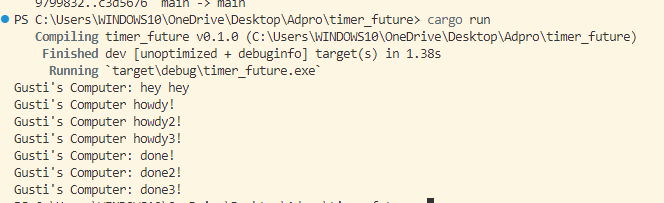
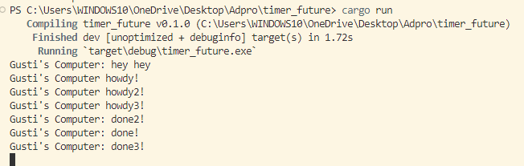

## Reflection 1.2

After we add `println!("Gusti's Computer: hey hey");`, when we run, we come to find out that this message gets printed out first, even though it appears after the spawner we spawned. Inn rust, when we spawn a task using `spawner.spawn`, it gets added to the ready queue. Then, the executor picks it up from the queue and starts executing it when the resources are available. 

In our `main.rs` file, we print "Gusti's Computer: hey hey" before dropping the spawner and running the executor. Since the executor hasn't started executing the spawned task yet, the "hey hey" message gets printed first.

## Reflection 1.3

### With drop(spawner);

### without

What we notice here, is that the tasks are run simultaneously. This means that the howdy! howdy2! and howdy3! appear at the same time and the done messages also appear at the same time after the same delay of 2 seconds.

What we also notice is that when we include `drop(spawner)`, the program finishes but the same thing does not happen in the program without. What happens here, is that when we drop the spawn before executor is run, the program doesnt listen for any new tasks and just closes, meanwhile without the drop, the program still looks for new tasks to run, hence it not closing autmatically. 
